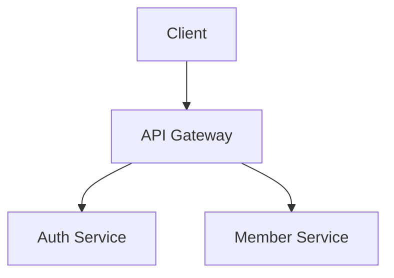

# Documentation

## README.md Template

```markdown
# Project Name

## Description
Brief project overview

## Installation
\`\`\`bash
npm install
\`\`\`

## Usage
\`\`\`bash
npm run dev
\`\`\`

## Features
- Feature 1
- Feature 2

## Tech Stack
- React
- TypeScript
- Tailwind CSS

## License
MIT
```

## JSDoc

```typescript
/**
 * Calculate member's BMI
 * @param weight - Weight in kg
 * @param height - Height in meters
 * @returns BMI value
 * @throws {Error} If height is zero
 */
function calculateBMI(weight: number, height: number): number {
  if (height === 0) throw new Error('Height cannot be zero');
  return weight / (height * height);
}
```

## API Documentation (OpenAPI)

```yaml
openapi: 3.0.0
info:
  title: Gym API
  version: 1.0.0
paths:
  /members:
    get:
      summary: List all members
      responses:
        '200':
          description: Success
```

## Architecture Diagrams

Use Mermaid for diagrams:


