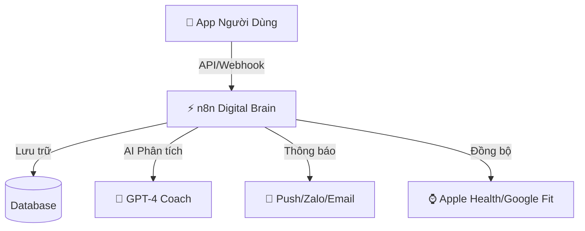

# 🏋️ BỘ NÃO TỰ ĐỘNG HÓA GYM APP (N8N MASTERPLAN)

> **Tài liệu chiến lược siêu chi tiết dựa trên phân tích UX/UI ứng dụng Fitness**
> *Phiên bản: 2.0 - Elite Fitness Automation System*

---

## 🗺️ TỔNG QUAN HỆ THỐNG
Dựa trên kiến trúc ứng dụng Mobile Fitness hiện đại, hệ thống n8n sẽ đóng vai trò là "Backend thông minh" xử lý mọi luồng dữ liệu, từ lúc người dùng mở app đến khi hoàn thành bài tập.

### Sơ đồ luồng dữ liệu chính:

---

## 1. 🚀 FLOW 1: ONBOARDING & KHỞI TẠO (GYM_ONBOARD_01)
**Mục tiêu:** Biến người lạ thành hội viên cam kết ngay từ giây đầu tiên.

### 1.1 Trigger: `User Registration Payload`
Dữ liệu nhận được từ App khi người dùng đăng ký tài khoản.

### 1.2 N8N Workflow Chi Tiết:
1. **Webhook Receiver (POST /onboarding)** for data reception.
2. **Data Validation:** Kiểm tra email, SĐT (tránh duplicate).
3. **AI Profile Analysis (LLM Node):**
    *   *Input:* Tuổi, cân nặng, chiều cao, mục tiêu (Tăng cơ/Giảm mỡ), mức độ vận động.
    *   *Prompt:* "Là chuyên gia fitness, hãy tính TDEE, BMR và đề xuất Macro (Protein/Carb/Fat) cho người dùng này. Tạo một lịch tập sơ bộ 4 tuần."
    *   *Output:* JSON Plan (Calories target, Workout Split).
4. **Database Create:** Tạo User Profile + Gán Plan khởi tạo.
5. **Welcome Sequence:**
    *   **Email 1 (Ngay lập tức):** "Chào mừng {name}! Đây là kế hoạch 4 tuần dành riêng cho bạn." (Kèm PDF kế hoạch).
    *   **Zalo Message:** "Kết bạn với HLV ảo của bạn tại đây để nhận nhắc nhở tập luyện!"
    *   **Task Creation:** Tạo task cho Sale Team "Follow up {name} sau 3 ngày trial".

---

## 2. 💪 FLOW 2: SMART WORKOUT TRACKING (GYM_WORKOUT_01)
**Mục tiêu:** Tự động hóa việc ghi nhận, phân tích và tối ưu buổi tập.

### 2.1 Trigger: `Workout Finished Payload`
Dữ liệu gửi về khi người dùng bấm "Hoàn thành buổi tập".

### 2.2 N8N Workflow Chi Tiết:
1. **Webhook Receiver (POST /workout-log)**
2. **Volume Calculation Node:**
    *   Công thức: `Tổng Volume = Σ (Weight * Reps * Sets)` cho từng nhóm cơ.
3. **PR Detector (Logic Node):**
    *   So sánh `Max Weight` hôm nay với lịch sử trong DB.
    *   *If New PR:* Trigger "Celebration sub-workflow".
4. **Recovery Analysis (AI Agent):**
    *   *Input:* Volume hôm nay, thời gian ngủ hôm qua (từ Wearable), mức độ stress (User input).
    *   *Output:* Điểm phục hồi & Khuyến nghị (VD: "Hôm nay tập chân nặng, mai hãy nghỉ ngơi hoặc cardio nhẹ").
5. **Sync to External:** Đẩy dữ liệu lên Strava/Apple Health (nếu tích hợp).
6. **Notification:** Gửi tổng kết buổi tập đẹp mắt qua App Notification.

---

## 3. 🥗 FLOW 3: AI NUTRITION COACH (GYM_NUTRI_01)
**Mục tiêu:** Biến việc track calories thành trải nghiệm đơn giản chỉ bằng hình ảnh.

### 3.1 Trigger: `Image Upload Payload`
Người dùng chụp ảnh bữa ăn.

### 3.2 N8N Workflow Chi Tiết:
1. **Webhook Receiver (Multipart Form-Data)**
2. **Computer Vision (GPT-4 Vision / Google Vision):**
    *   *Prompt:* "Nhận diện món ăn trong ảnh. Ước lượng khối lượng từng thành phần. Tính tổng Calo, Protein, Carb, Fat. Trả về JSON."
3. **Logic Check:**
    *   So sánh với `Daily Target` của người dùng.
    *   *Scenario A (Còn thiếu):* "Bạn còn thiếu 40g Protein. Hãy làm một ly Whey nhé!"
    *   *Scenario B (Vượt lố):* "Bữa này hơi nhiều Carb rồi, giảm cơm vào bữa tối nhé."
4. **Database Log:** Lưu nhật ký ăn uống.
5. **Feedback Loop:** Gửi phản hồi ngay lập tức về App.

---

## 4. 🩸 FLOW 4: HEALTH & SAFETY MONITOR (GYM_SAFE_01)
**Mục tiêu:** Phát hiện sớm các rủi ro sức khỏe dựa trên data.

### 4.1 Trigger: `Daily Sync (Scheduled)` & `Wearable Webhook`

### 4.2 N8N Workflow Chi Tiết:
1. **Schedule Trigger:** Chạy 6:00 AM mỗi ngày.
2. **Fetch Data:** Lấy dữ liệu nhịp tim (HRV, RHR), giấc ngủ từ DB.
3. **Anomaly Detection (Code Node):**
    *   *Rule 1:* Nếu HRV giảm > 20% so với trung bình 7 ngày -> Cảnh báo Fatigue (Mệt mỏi).
    *   *Rule 2:* Nếu Nhịp tim nghỉ (RHR) tăng đột biến -> Cảnh báo Ốm/Stress.
4. **Action:**
    *   *If Risk Detected:* Gửi thông báo "Cơ thể bạn đang báo động. Hệ thống đề xuất giảm cường độ tập hôm nay 50%."
    *   *Alert Coach:* Gửi tin nhắn cho PT riêng (nếu có gói PT) để điều chỉnh giáo án.

---

## 5. 🎮 FLOW 5: GAMIFICATION & RETENTION (GYM_GAME_01)
**Mục tiêu:** Giữ chân người dùng bằng cơ chế game hóa.

### 5.1 Trigger: `Daily Check` & `Event Trigger`

### 5.2 N8N Workflow Chi Tiết:
1. **Streak Checker:**
    *   Kiểm tra chuỗi ngày đăng nhập/tập luyện liên tiếp.
    *   *Milestone:* 3 ngày, 7 ngày, 30 ngày.
2. **Badge Allocator:**
    *   Nếu đạt Milestone -> Mở khóa huy hiệu (Badge SVG) -> Push Notif.
3. **Social Share Generator:**
    *   Tự động tạo ảnh "Thành tích tuần" (sử dụng thư viện tạo ảnh/HTML-to-Image).
    *   Gợi ý người dùng chia sẻ lên Story Facebook/Insta.
4. **Sleepers Arousal (Retention):**
    *   Nếu User `Inactive > 7 days`:
        *   Gửi email "Chúng tôi nhớ bạn! 🥺".
        *   Tặng Voucher nước uống miễn phí nếu quay lại trong 24h.

---

## 🛠️ CẤU HÌNH KỸ THUẬT (Technical Stack)

*   **N8N Nodes sử dụng:**
    *   `Webhook`: Nhận data realtime.
    *   `Postgres/MySQL`: Node thao tác DB.
    *   `OpenAI`: GPT-4 cho phân tích thông minh.
    *   `Telegram/Discord/Slack`: Để thông báo nội bộ team vận hành.
    *   `SendGrid/Gmail`: Gửi email marketing.
*   **Authentication:** Sử dụng JWT Token trong Header của Webhook để bảo mật.
*   **Error Handling:** Workflow "Error Catcher" riêng biệt để log lỗi vào Telegram Admin.

---

> **Ghi chú:** Đây là bản quy hoạch tổng thể cấp cao (High-Level Architecture). Khi triển khai thực tế, từng workflow sẽ được break down thành các node cụ thể với logic Javascript chi tiết.
