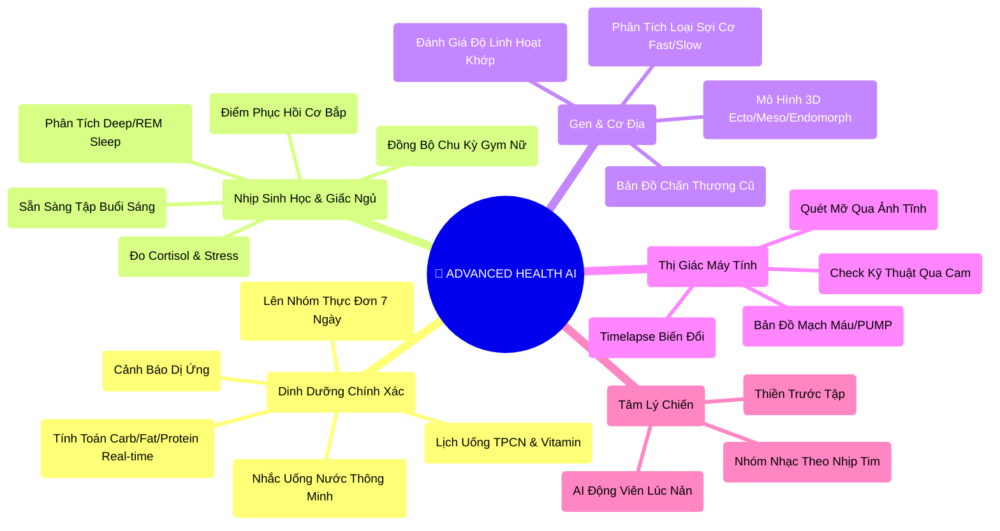

# 🧬 N8N ADVANCED HEALTH AI STRATEGY (HEALTH 360 PRO)

## 1. 🧠 HEALTH 360 MINDMAP (Phân Rã Chức Năng)



---

## 2. 🤖 "THE BILLION-STEP" AUTOMATION FLOWS (Kịch Bản n8n)

Đây là các luồng xử lý dữ liệu phức tạp, biến Gym thành một phòng Lab sinh học.

### WORKFLOW 1: 🛑 THE INJURY GUARDIAN (Vệ Thần Chấn Thương)
**Mục tiêu:** Tự động điều chỉnh giáo án ngay lập tức khi hội viên báo đau hoặc có dấu hiệu quá tải.

**Steps:**
1.  **Trigger:** Hội viên log "Đau lưng dưới" vào app HOẶC Smartwatch đo được HRV (Heart Rate Variability) quá thấp (Dấu hiệu stress cơ).
2.  **AI Analysis (n8n Node):**
    *   Check lịch sử chấn thương: "Người này từng thoát vị đĩa đệm 2 năm trước".
    *   Check lịch tập tuần này: "Đang có lịch Deadlift nặng vào ngày mai".
3.  **Action (Decision):** **DỪNG NGAY LẬP TỨC**.
4.  **Auto-Modification:**
    *   Xóa bài *Deadlift* khỏi lịch ngày mai.
    *   Thay bằng *Hyperextension (Nhẹ)* hoặc *Yoga Cobra Pose*.
    *   Gửi thông báo: *"Phát hiện dấu hiệu quá tải lưng. AI đã đổi bài Deadlift ngày mai thành Phục hồi cơ lưng. Vui lòng không tập nặng!"*
5.  **Notify Trainer:** Bắn tin nhắn cho PT: *"Khách A đang đau lưng, chú ý giám sát kỹ thuật."*

### WORKFLOW 2: 🩸 FEMALE CYCLE SYNC (Đồng Bộ Chu Kỳ)
**Mục tiêu:** Tối ưu hóa việc tập luyện dựa trên thay đổi hormone hàng tháng của nữ giới.

**Steps:**
1.  **Data In:** App nhận dữ liệu chu kỳ (Day 1, Day 14 - Rụng trứng, Day 28).
2.  **Phase Identification:**
    *   *Pha Nang Trứng (Follicular):* Năng lượng cao, chịu đau tốt -> **AI Đẩy tạ nặng (PR Mode)**.
    *   *Pha Hoàng Thể (Luteal):* Thân nhiệt tăng, giữ nước, mệt mỏi -> **AI Giảm tạ (Deload), Tăng Cardio nhẹ**.
    *   *Kỳ Kinh (Menstruation):* **AI chuyển sang Yoga/Stretching**, bỏ gập bụng.
3.  **Nutrition Adjust:**
    *   *Luteal Phase:* Tự động tăng Magnesium & Chocolate đen trong thực đơn (Giảm thèm ngọt).
4.  **Output:** Update lịch tập & thực đơn hàng ngày tự động theo pha hormone.

### WORKFLOW 3: 🧬 GENOMIC HYPER-PERSONALIZATION (Cá Nhân Hóa Gen)
**Mục tiêu:** Tập luyện dựa trên mã gen (giả lập hoặc import data thật).

**Steps:**
1.  **Trigger:** Nhập dữ liệu Gen (Ví dụ Gen ACTN3 - Gen tốc độ/sức mạnh).
2.  **Profiling:**
    *   *Biến thể RR (Sợi cơ nhanh):* Ưu tiên HIIT, Sprint, Tạ nặng ít reps.
    *   *Biến thể XX (Sợi cơ bền):* Ưu tiên LISS Cardio, Tạ nhẹ nhiều reps (Endurance).
3.  **Workflow Processing:**
    *   Quét toàn bộ giáo án hiện tại.
    *   Nếu là *RR Type* mà đang tập *Marathon* -> **Cảnh báo không hiệu quả**.
    *   Tự động Re-build giáo án: Chuyển 60% bài tập sang dạng bùng nổ (Explosive).
4.  **Recovery Gene (Gen phục hồi):** Nếu có gen phục hồi chậm (IL6, CRP) -> Tự động thêm +1 ngày nghỉ xen kẽ các buổi leg day.

### WORKFLOW 4: 😴 SLEEP-TO-PERFORMANCE (Giấc Ngủ Quyết Định Tạ)
**Mục tiêu:** Điều chỉnh cường độ tập buổi sáng dựa trên chất lượng giấc ngủ đêm qua.

**Steps:**
1.  **Sync (06:00 AM):** Pull data từ Apple Health/Garmin.
2.  **Analyze:**
    *   Giấc ngủ < 5 tiếng HOẶC Deep Sleep < 10%.
    *   Resting Heart Rate (RHR) tăng đột biến > 10%.
3.  **Decision Maker:** Cơ thể chưa phục hồi. Rủi ro chấn thương cao.
4.  **Auto Action:**
    *   Giảm volume buổi tập hôm nay xuống 50% (RPE thấp).
    *   Đổi bài compound nặng (Squat) thành máy (Leg Press) để an toàn hơn.
    *   Gửi push noti: *"Hôm qua ngủ ít quá! Nay tập dưỡng sinh thôi nhé, AI đã giảm tạ giúp bạn rồi."*

---

## 3. 🍱 CẤU TRÚC DỮ LIỆU HEALTH (JSON SCHEMAS)

```json
// Mô hình dữ liệu phức tạp cho Nutri & Bio
{
  "member_id": "MEM_001",
  "bio_data": {
    "genetics": {
       "muscle_fiber_type": "Fast_Twitch_Dominant",
       "caffeine_sensitivity": "High",
       "recovery_rate": "Slow"
    },
    "cycle_tracking": { // For Female
       "current_phase": "Luteal",
       "next_period_date": "2026-02-15",
       "symptoms": ["Bloating", "Fatigue"]
    },
    "wearable_sync": {
       "last_sync": "2026-01-31T06:00:00Z",
       "sleep_score": 65,
       "hrv_status": "Unbalanced",
       "readiness_score": 45
    }
  },
  "ai_coach_settings": {
    "auto_adjust_intensity": true,
    "injury_protection_mode": "Aggressive", // Cẩn thận tuyệt đối
    "goal_timeline": "Wedding_Day_Target" // Mục tiêu sự kiện cụ thể
  }
}
```

## 4. 🖥️ GIAO DIỆN ĐỀ XUẤT (UI MODULES SẼ LÀM)

1.  **Tab "Bio-Hacking"**: Nơi hiển thị các chỉ số sâu (Gen, Máu, Hormone).
2.  **Tab "Smart Kitchen"**: Meal Plan tự động, shopping list tự động sinh ra.
3.  **Tab "Recovery Hub"**: Chỉ số phục hồi & gợi ý massage/sauna.

---
*Tài liệu này đóng vai trò là kiến trúc lõi cho việc phát triển các tính năng Sức Khỏe AI trong tương lai.*
